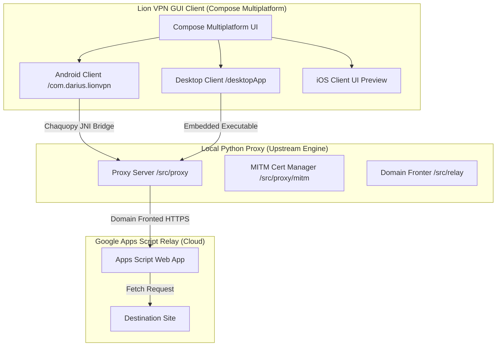

# 🦁 Lion VPN — Compose Multiplatform GUI Client

[](https://github.com/dariushm2/CMP-GUI-MasterHttpRelayVPN)
[](https://kotlinlang.org/)
[](https://jetbrains.com/lp/compose-multiplatform/)
[](LICENSE)

🦁 **Lion VPN** is a modern, beautiful, and high-performance **Compose Multiplatform GUI client** designed for the domain-fronted proxy relay system. 

It provides an intuitive, one-click graphical interface that bundles, launches, and manages the local Python proxy server on multiple platforms.

**Language:** English | [Persian / فارسی](README_FA.md)

> [!NOTE]
> This repository is a fork of the incredible [masterking32/MasterHttpRelayVPN](https://github.com/masterking32/MasterHttpRelayVPN). 
> The core proxy relay engine runs the upstream Python implementation. All graphical multiplatform user interface code, native platform integrations (Android VPN services, Desktop packaging, reactive state-flow bridges, and JNI performance optimizations) reside in the **`/cmp`** folder and are developed as a custom multiplatform GUI wrapper.

---

## 🧭 Project Architecture



---

## ⚡ Key Features

*   **🎨 Premium UI/UX:** Built using state-of-the-art Compose Multiplatform styling, supporting dark mode, smooth micro-animations, and dynamic HSL color accents.
*   **🔌 One-Click Connection:** Simple, beautiful connect button with pulsating status indicator that boots and terminates the proxy server automatically in the background.
*   **📱 Native Android Integration (`VpnService`):** Custom Android system VPN wrapper that captures device traffic and routes it directly to the local SOCKS5/HTTP proxy, removing the need for manual browser proxy configuration.
*   **💻 One-Click Desktop Executable:** Optimized desktop build system that compiles and packages the Python proxy into a single standalone binary using PyInstaller.
*   **🔒 HTTPS MITM Certificate Generator:** Seamlessly generate, export, and trigger device installation prompts for the local CA intercept certificate natively from the interface.
*   **⚡ Zero UI Blocking & High Performance:** Highly optimized JNI Logging mechanism that isolates logging paths to prevent bridge bottlenecks, accompanied by async background thread execution for seamless state changes.

---

## 🚀 Getting Started

To get started, first deploy your Google Apps Script relay. This is identical to the upstream process:

### 1. Deploy The Google Relay ☁️

1. Open [Google Apps Script](https://script.google.com/) and sign in.
2. Click **New project**.
3. Delete the default editor content.
4. Open [apps_script/Code.gs](apps_script/Code.gs), copy everything, and paste it into Apps Script.
5. Replace this line with your own long secret:
    ```javascript
    const AUTH_KEY = "your-secret-password-here";
    ```
6. Click **Deploy** -> **New deployment** -> **Web app**.
7. Set **Execute as** to **Me** and **Who has access** to **Anyone**, then click **Deploy**.
8. Copy the **Deployment ID** and keep your `AUTH_KEY` ready.

---

### 2. Running the GUI Apps 📱💻

All GUI application source code and build tasks reside in the `/cmp` directory. 

Before building, navigate to the `/cmp` folder in your terminal:
```bash
cd cmp
```

#### 💻 Desktop App (macOS, Windows, Linux)
The desktop build automatically compiles and packages the Python proxy engine into your app resources folder.

*   **Run Developer Dev Server:**
    ```bash
    ./gradlew :desktopApp:run
    ```
*   **Build Standalone Distribution Package:**
    ```bash
    ./gradlew :desktopApp:packageDistributionForCurrentOS
    ```
    This generates native installers (e.g., `.dmg` on macOS, `.msi` on Windows, `.deb` on Linux) inside the `cmp/desktopApp/build/compose/binaries` directory.

#### 📱 Android App
*   **Run / Install Debug APK on Device:**
    Make sure you have an Android device or emulator running and connected via ADB:
    ```bash
    ./gradlew :androidApp:installDebug
    ```
*   **Compile Release APK:**
    ```bash
    ./gradlew :androidApp:assembleRelease
    ```
    The compiled APKs will be saved in `cmp/androidApp/build/outputs/apk/`.

#### 🍏 iOS App (UI Preview)
*   Open the `/cmp/iosApp/iosApp.xcodeproj` project in Xcode to build, compile, and run on the iOS Simulator or devices. Note that system VPN features on iOS are currently under simulation.

---

## 🛠️ Project Technical Stack

*   **UI Framework:** [Compose Multiplatform](https://github.com/JetBrains/compose-multiplatform) (by JetBrains)
*   **Dependency Injection:** [Koin](https://insert-koin.io/) (for multiplatform DI registration)
*   **HTTP Client:** [Ktor Client](https://ktor.io/) (Ktor-Darwin for iOS, Ktor-OkHttp for Android)
*   **Logging Engine:** [Timber](https://github.com/JakeWharton/timber) (Android) & custom console pipes
*   **Embedded Python Runtimes:**
    *   **Android:** [Chaquopy](https://chaquo.com/chaquopy/) (embeds CPython into Gradle build flows)
    *   **Desktop:** [PyInstaller](https://pyinstaller.org/) & native environment launchers
*   **Navigation:** Jetpack Navigation Compose Multiplatform

---

## 📣 Support and Contributions

*   For the original upstream server issues and command-line support, visit the upstream repository: [masterking32/MasterHttpRelayVPN](https://github.com/masterking32/MasterHttpRelayVPN).
*   For GUI interface bugs, performance optimization requests, and mobile client improvements, feel free to open an issue or pull request under this fork!

---

## 🛡️ License

This project is licensed under the **MIT License** — see the [LICENSE](LICENSE) file for details.
