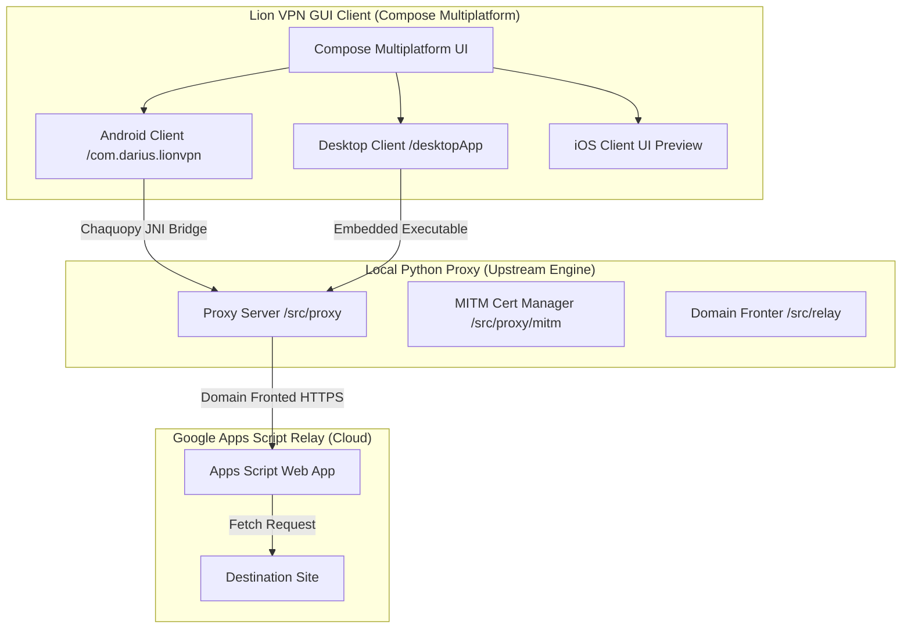

# 🦁 لاین وی‌پی‌ان (Lion VPN) — کلاینت گرافیکی چندسکویی (Compose Multiplatform)

[](https://github.com/dariushm2/CMP-GUI-MasterHttpRelayVPN)
[](https://kotlinlang.org/)
[](https://jetbrains.com/lp/compose-multiplatform/)
[](LICENSE)

🦁 **لاین وی‌پی‌ان (Lion VPN)** یک کلاینت گرافیکی (GUI) مدرن، زیبا و با کارایی بالا برای سیستم پراکسی رله مبتنی بر دامین فرانتینگ (Domain Fronting) است که با استفاده از **Compose Multiplatform** ساخته شده است.

این کلاینت یک رابط کاربری بصری و تک‌کلیکی فراهم می‌کند که سرور پراکسی پایتون محلی را به‌طور خودکار روی پلتفرم‌های مختلف بسته‌بندی، اجرا و مدیریت می‌کند.

**زبان:** [English](README.md) | فارسی

> [!NOTE]
> این مخزن یک فورک از پروژه فوق‌العاده [masterking32/MasterHttpRelayVPN](https://github.com/masterking32/MasterHttpRelayVPN) است.
> هسته اصلی موتور رله پراکسی توسط کدهای پایتون بالادستی (Upstream) اجرا می‌شود. تمامی کدهای مربوط به رابط کاربری گرافیکی چندسکویی، ادغام‌های بومی پلتفرم‌ها (سرویس VPN اندروید، بسته‌بندی دسکتاپ، پل‌های واکنشی State-Flow و بهینه‌سازی‌های کارایی JNI) در پوشه **`/cmp`** قرار دارند و به عنوان یک پوسته گرافیکی چندسکویی اختصاصی توسعه داده شده‌اند.

---

## 🧭 معماری پروژه



---

## ⚡ ویژگی‌های کلیدی

*   **🎨 طراحی و ظاهر پرمیوم (UI/UX):** ساخته شده با آخرین استانداردهای طراحی Compose Multiplatform، پشتیبانی کامل از حالت تاریک (Dark Mode)، میکرواِنیمیشن‌های روان و رنگ‌های گرادیانت هارمونیک.
*   **🔌 اتصال تک‌کلیکی:** دکمه اتصال ساده و زیبا با نشانگر وضعیت تپنده که سرور پراکسی را به‌صورت خودکار در پس‌زمینه راه‌اندازی و متوقف می‌کند.
*   **📱 ادغام بومی اندروید (`VpnService`):** پوسته اختصاصی اندروید برای هدایت ترافیک کل سیستم به پراکسی محلی SOCKS5/HTTP بدون نیاز به تنظیم دستی پراکسی در تنظیمات وای‌فای.
*   **💻 خروجی تک‌کلیکی دسکتاپ:** سیستم ساخت بهینه‌شده برای دسکتاپ که سرور پایتون را با استفاده از PyInstaller به یک فایل اجرایی مستقل بسته‌بندی می‌کند.
*   **🔒 تولیدکننده خودکار گواهی HTTPS MITM:** تولید، خروجی گرفتن و نصب گواهی محلی CA برای عبور امن از ترافیک رمزنگاری‌شده HTTPS مستقیماً از داخل برنامه.
*   **⚡ کارایی بالا بدون قفل شدن رابط کاربری:** مکانیزم ورود لاگ بسیار سریع JNI برای جلوگیری از کندی برنامه در حین انتقال داده‌ها به همراه ترد پس‌زمینه آسنکرون برای سرعت حداکثری.

---

## 🚀 راهنمای راه‌اندازی و استفاده

برای شروع، ابتدا رله Google Apps Script خود را مستقر (Deploy) کنید. این بخش کاملاً مشابه پروژه اصلی است:

### ۱. ساخت رله Google ☁️

۱. وارد [Google Apps Script](https://script.google.com/) شوید و با اکانت گوگل خود ورود کنید.
۲. روی **New project** کلیک کنید.
۳. محتوای پیش‌فرض ادیتور را کاملاً پاک کنید.
۴. فایل [apps_script/Code.gs](apps_script/Code.gs) را باز کرده، تمامی کدهای آن را کپی کنید و در ادیتور Apps Script قرار دهید.
۵. مقدار `AUTH_KEY` را با یک رمز طولانی و مخصوص به خود جایگزین کنید:
    ```javascript
    const AUTH_KEY = "your-secret-password-here";
    ```
۶. روی **Deploy** -> **New deployment** -> **Web app** کلیک کنید.
۷. گزینه **Execute as** را روی **Me** و **Who has access** را روی **Anyone** تنظیم کرده و دکمه **Deploy** را بزنید.
۸. شناسه **Deployment ID** و رمز `AUTH_KEY` را یادداشت کنید.

---

### ۲. اجرای برنامه‌های گرافیکی 📱💻

تمام کدهای منبع برنامه‌های رابط کاربری و دستورات ساخت آن‌ها در پوشه `/cmp` قرار دارند.

> [!TIP]
> **ساخت سریع نسخه نصبی مستقل دسکتاپ:** شما می‌توانید با اجرای دستور زیر، یک فایل نصبی بومی و مستقل برای سیستم‌عامل فعلی خود تولید کنید:
> ```bash
> cd cmp && ./gradlew :desktopApp:packageDistributionForCurrentOS
> ```

قبل از شروع، در ترمینال خود به پوشه `/cmp` بروید:
```bash
cd cmp
```


#### 💻 نسخه دسکتاپ (macOS, Windows, Linux)
سیستم ساخت دسکتاپ به‌طور خودکار موتور پراکسی پایتون را کامپایل کرده و در منابع برنامه قرار می‌دهد.

*   **اجرا در حالت توسعه (Dev Mode):**
    ```bash
    ./gradlew :desktopApp:run
    ```
*   **خروجی گرفتن نسخه نصبی نهایی:**
    ```bash
    ./gradlew :desktopApp:packageDistributionForCurrentOS
    ```
    این دستور فایل نصبی بومی (مانند `.dmg` روی مک، `.msi` روی ویندوز و `.deb` روی لینوکس) را در مسیر `cmp/desktopApp/build/compose/binaries` ایجاد می‌کند.

#### 📱 نسخه اندروید
*   **نصب مستقیم نسخه دیباگ روی گوشی یا شبیه‌ساز:**
    مطمئن شوید گوشی اندرویدی یا شبیه‌ساز روشن و متصل به ADB است:
    ```bash
    ./gradlew :androidApp:installDebug
    ```
*   **کامپایل فایل APK نهایی:**
    ```bash
    ./gradlew :androidApp:assembleRelease
    ```
    فایل‌های APK خروجی در مسیر `cmp/androidApp/build/outputs/apk/` ذخیره می‌شوند.

#### 🍏 نسخه iOS (پیش‌نمایش رابط کاربری)
*   پروژه `/cmp/iosApp/iosApp.xcodeproj` را در Xcode باز کنید تا بتوانید پیش‌نمایش رابط کاربری آن را روی شبیه‌ساز یا دستگاه‌های iOS اجرا کنید. (قابلیت‌های شبکه در حال حاضر به‌صورت شبیه‌سازی‌شده است).

---

## 🛠️ تکنولوژی‌های مورد استفاده

*   **فریم‌ورک رابط کاربری:** [Compose Multiplatform](https://github.com/JetBrains/compose-multiplatform) (توسط JetBrains)
*   **تزریق وابستگی:** [Koin](https://insert-koin.io/) (تزریق وابستگی چندسکویی)
*   **محیط‌های پایتون داخلی:**
    *   **اندروید:** [Chaquopy](https://chaquo.com/chaquopy/) (اجرای پایتون به‌صورت بومی درون اندروید)
    *   **دسکتاپ:** [PyInstaller](https://pyinstaller.org/) (کامپایلر مستقل پایتون)
*   **مسیریابی:** Jetpack Navigation Compose Multiplatform

---

## 📣 پشتیبانی و مشارکت

*   برای گزارش مشکلات مربوط به سرور و موتور پراکسی اصلی و کدهای پایتون، به مخزن اصلی مراجعه کنید: [masterking32/MasterHttpRelayVPN](https://github.com/masterking32/MasterHttpRelayVPN).
*   برای گزارش باگ‌های رابط کاربری، درخواست‌های بهینه‌سازی کارایی و بهبود کلاینت‌های موبایل، خوشحال می‌شویم یک Issue یا Pull Request روی این فورک ثبت کنید!

---

## 🛠️ دستورالعمل‌های توسعه (Development Guidelines)

برای حفظ نظم، تمیزی و مقیاس‌پذیری کدها در این پروژه فورک، تمامی مشارکت‌ها (به‌ویژه در پوشه `/cmp`) باید به طور دقیق از دستورالعمل‌های توسعه ما پیروی کنند.

برای جزئیات کامل، لطفاً سند مربوطه را مطالعه فرمایید:
* **[دستورالعمل‌ها و قوانین توسعه CMP](file:///Users/dariush/Projects/CMP-GUI-MasterHttpRelayVPN/cmp/skills/cmp-rules/SKILL.md)**

اصول کلیدی عبارتند از:
۱. **تفکیک از پروژه اصلی:** تمام کدهای سفارشی را فقط در پوشه `/cmp` قرار دهید و کدهای اصلی بالادستی (upstream) را به هیچ وجه تغییر ندهید.
۲. **کامپوزبل‌های کوچک و مجزا:** از ایجاد فایل‌های کامپوزر بزرگ خودداری کنید. کامپوزبل‌ها را به توابع کوچکتر شکسته و در فایل‌ها یا پکیج‌های مجزا سازماندهی کنید. همچنین پارامتر `modifier: Modifier = Modifier` باید آخرین پارامتر در هر کامپوزبل باشد.
۳. **عدم تزریق Context به ViewModelها:** برای جلوگیری از نشت حافظه (Memory Leak)، هرگز کلاس `Context` اندروید را به ViewModelها پاس ندهید.
۴. **معماری ماژولار و مستقل:** منطق برنامه را کپسوله‌سازی کرده و از دیزاین‌پترن‌های Delegate، Manager و Provider استفاده کنید.
۵. **عدم هاردکد کردن منابع:** از هاردکد کردن رشته‌ها یا رنگ‌ها خودداری کرده و همیشه از منابع استاندارد (Resources) استفاده کنید.
۶. **منظم‌سازی Importها:** هرگز از ایمپورت‌های ستاره‌دار (`*`) استفاده نکنید و همیشه پس از هر تغییر ایمپورت‌های فایل را بهینه‌سازی کنید.
۷. **محدودیت تعداد خطوط فایل:** فایل‌های منبع را ساده و خوانا نگه‌دارید (ترجیحاً کمتر از ۵۰۰ خط).
۸. **استاندارد پول‌ریکوئست‌ها (Pull Requests):** عنوان PR باید با شماره ایشو در براکت شروع شود (مثال: `[45] Title`) و خط اول توضیحات PR حتماً باید شامل `# #<issue_number>` باشد (مثال: `# #45`).

---

## 🛡️ مجوز (License)

این پروژه تحت مجوز **MIT** منتشر شده است — برای اطلاعات بیشتر فایل [LICENSE](LICENSE) را مطالعه کنید.

